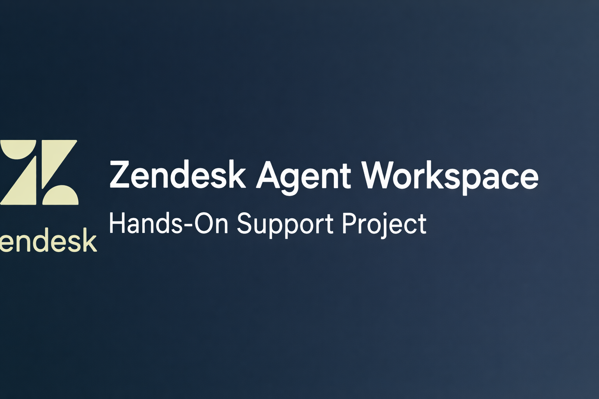

# Zendesk Agent Workspace – Hands-On Support Project

This project demonstrates hands-on experience using **Zendesk Agent Workspace (New UI)** to manage the full support ticket lifecycle. It showcases real-world workflows including ticket creation, assignment, prioritization, views & queues, macros, ticket forms, and **priority-based SLA policies**.

This project is designed to reflect how a **Support Agent / Help Desk Technician** operates in a production support environment.

---

## 🧰 Tools & Platform
- Zendesk Agent Workspace (New UI)
- Ticket Views & Queues
- Macros & Automation
- Ticket Forms & Fields
- Priority-based SLA Policies

---

## 🎯 Project Objectives
- Create and manage support tickets end-to-end
- Apply ticket priority and forms correctly
- Use views to manage queues efficiently
- Respond to customers using public replies
- Configure and validate SLA targets
- Document workflows clearly for handoff and audit

---

## 🔄 Workflow Walkthrough (Screenshots)

### 1️⃣ Agent Workspace Overview
Agents manage conversations, ticket fields, and customer context in a single unified workspace.

---

### 2️⃣ Ticket Assigned to Agent
The ticket is routed and assigned to the appropriate support agent for ownership.

---

### 3️⃣ Ticket Type & Priority Set
Ticket type and priority are configured to ensure correct routing and SLA application.

---

### 4️⃣ Public Reply Added
A public reply is sent to the customer acknowledging the issue and next steps.

---

### 5️⃣ Ticket Submitted as Open
The ticket is submitted and remains open while work is actively in progress.

---

### 6️⃣ Default Views & Queues
Default Zendesk views are used to manage ticket queues efficiently.

---

### 7️⃣ New & Unassigned Tickets View
Agents monitor unassigned tickets to ensure timely ownership.

---

### 8️⃣ Macros Page
Macros are configured to speed up responses and maintain consistency.

---

### 9️⃣ Macro Used: Request More Info
A macro is applied to request additional information from the customer.

---

### 🔟 New Ticket Submitted
A new ticket is created using the configured ticket form.

---

### 1️⃣1️⃣ Ticket Form Editable & Enabled
Ticket forms are enabled and configured to capture the correct data.

---

### 1️⃣2️⃣ SLA Policy Configuration
Priority-based SLA targets are configured and validated.

---

### 1️⃣3️⃣ High-Priority Ticket Created
A high-priority incident ticket is created to test SLA behavior.

---

### 1️⃣4️⃣ Ticket Response & Customer Update
The agent responds with a clear update while the ticket remains in progress.

---

## ✅ Key Takeaways for Recruiters
- Hands-on Zendesk Agent Workspace experience
- Realistic ticket lifecycle workflows
- Strong understanding of SLAs, priorities, and queues
- Customer-focused communication
- Production-ready documentation skills

---

📌 *This project was built to mirror real-world Tier 1 / Tier 2 support workflows used in SaaS and IT environments.*
