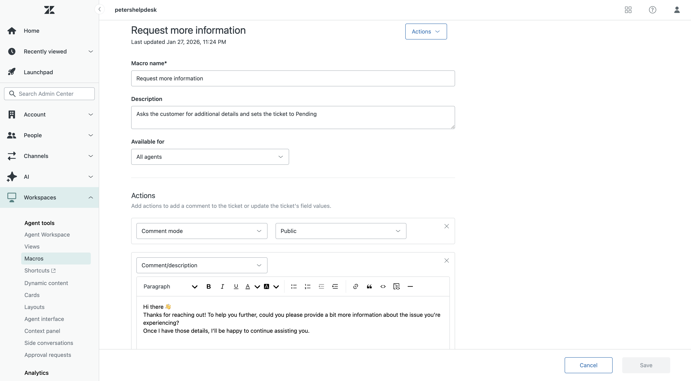

# Zendesk Agent Workspace – Hands-On Support Project

This project demonstrates hands-on experience using **Zendesk Agent Workspace** to manage the full support ticket lifecycle. It showcases real-world workflows including ticket creation, assignment, prioritization, views, macros, ticket forms, and SLA policies using Zendesk’s **new interface**.

This project is designed to reflect how a Support Agent or Help Desk Technician works in a production environment.

---

## 🧰 Tools & Platform
- Zendesk Agent Workspace (New UI)
- Ticket Views & Queues
- Macros & Automation
- Ticket Forms & Fields
- Priority-based SLA Policies

---

## 📌 Project Objectives
- Create and manage support tickets end-to-end
- Apply priority and ticket forms correctly
- Use views to manage queues efficiently
- Respond to customers using public replies
- Configure and validate SLA targets
- Document workflows clearly for handoff and audit

---

## 📸 Workflow Walkthrough (Screenshots)

### 1️⃣ Agent Workspace Overview
Agents manage conversations, ticket fields, and customer context in a single unified workspace.

---

### 2️⃣ Ticket Assigned to Agent
Ticket is routed and assigned to the appropriate support agent for ownership.

---

### 3️⃣ Ticket Type & Priority Set
Ticket form and priority are set to reflect business impact.

---

### 4️⃣ Public Reply Added
Agent sends a customer-facing response to acknowledge and begin troubleshooting.

---

### 5️⃣ Ticket Submitted as Open
Ticket status is updated and officially enters the support queue.

---

### 6️⃣ Default Views & Queues
Agents use predefined views to manage workloads efficiently.

---

### 7️⃣ New & Unassigned View
View used to identify tickets requiring assignment.

---

### 8️⃣ Macros Page
Macros are used to standardize responses and speed up resolution.

---

### 9️⃣ Macro Applied – Request More Info
Agent applies a macro to gather missing customer details.

---

### 🔟 New Ticket Submitted
Demonstrates ticket creation from the agent side.

---

### 1️⃣1️⃣ Editable Ticket Form Enabled
Ticket fields are configured to allow controlled agent edits.

---

### 1️⃣2️⃣ SLA Policy Configuration
Priority-based SLA targets are defined to meet response and resolution goals.

---

### 1️⃣3️⃣ High Priority Ticket Created
High-impact incident created to trigger SLA tracking.

---

### 1️⃣4️⃣ Agent Response Logged
Agent communication and status updates are recorded in the ticket timeline.

---

## ✅ Key Skills Demonstrated
- Zendesk ticket lifecycle management
- Customer communication & documentation
- SLA awareness and prioritization
- Queue and workload management
- Support process consistency

---

## 📎 Use Case
This project reflects real-world Help Desk and Technical Support workflows and is intended for recruiters and hiring managers evaluating hands-on Zendesk experience.

