## 📸 Screenshots – Zendesk Agent Workspace Project

This section documents a hands-on Zendesk Agent Workspace project using the **new Zendesk UI**.  
Each screenshot clearly explains **what was done**, **why it matters**, and **what skill it demonstrates**, written for recruiters and hiring managers.

---

### 1. Agent Workspace Overview
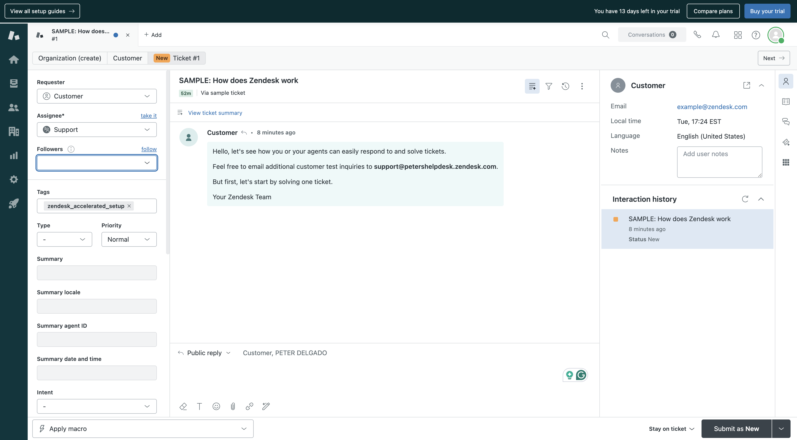

**What I did:**  
Worked within Zendesk’s Agent Workspace where tickets, conversations, and customer context are managed in one unified interface.

**Why it matters:**  
Agent Workspace improves efficiency by reducing context switching and giving agents a single place to manage support workflows.

**Skills demonstrated:**  
- Zendesk Agent Workspace navigation  
- Unified ticket management  

---

### 2. Ticket Assigned to Agent
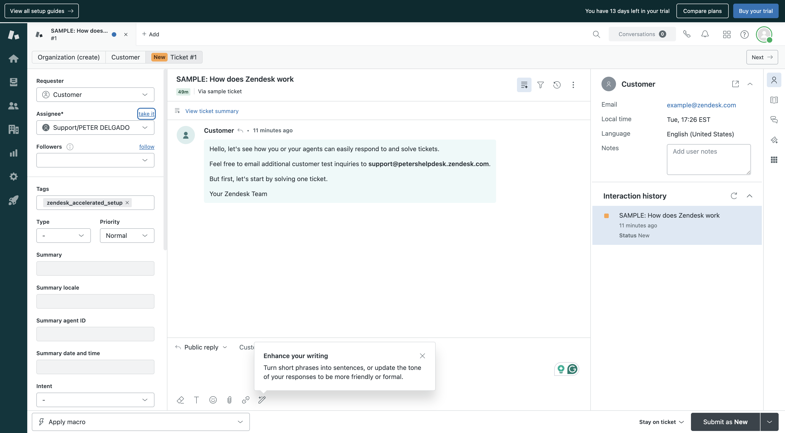

**What I did:**  
Assigned an incoming ticket to myself to establish ownership and responsibility.

**Why it matters:**  
Proper assignment ensures accountability and prevents tickets from being overlooked.

**Skills demonstrated:**  
- Ticket ownership  
- Assignment workflows  

---

### 3. Ticket Type and Priority Set
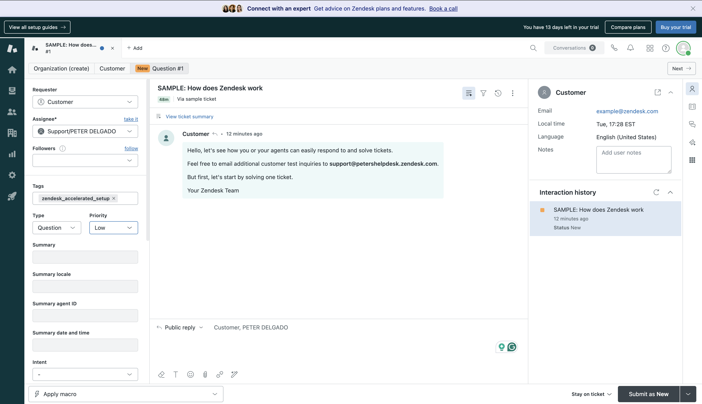

**What I did:**  
Set the ticket type and priority level to reflect the severity of the issue.

**Why it matters:**  
Priority directly affects SLA timers, escalation paths, and response urgency.

**Skills demonstrated:**  
- Ticket classification  
- Priority-based workflow management  

---

### 4. Public Reply Added
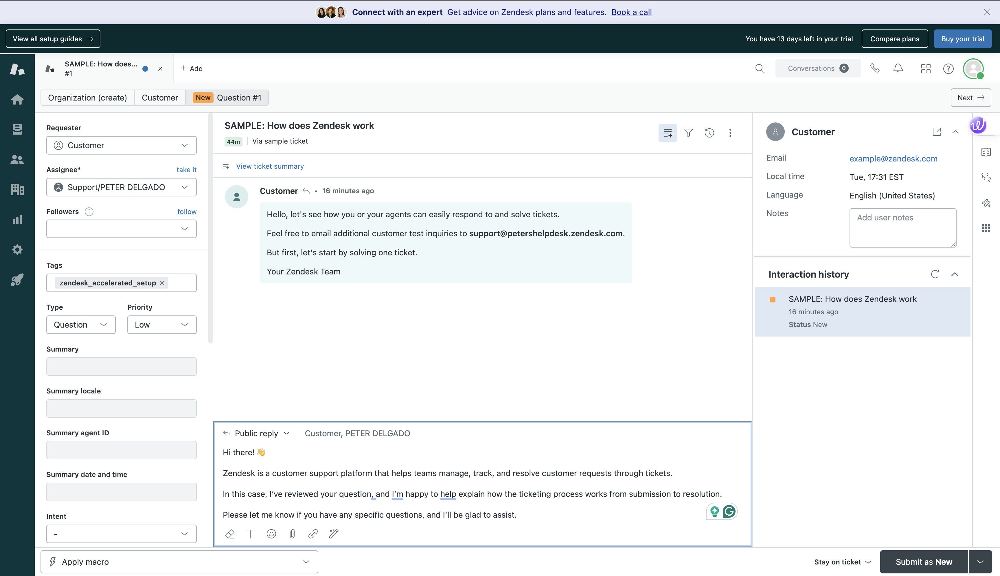

**What I did:**  
Added a professional public response acknowledging the issue and setting expectations with the customer.

**Why it matters:**  
Clear communication builds trust and meets first-response SLA requirements.

**Skills demonstrated:**  
- Customer communication  
- First-response handling  

---

### 5. Ticket Submitted as Open
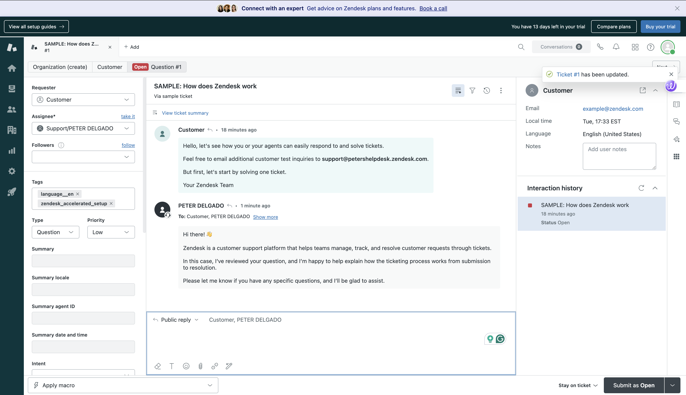

**What I did:**  
Submitted the ticket as **Open** to ensure it remained active and tracked after the initial response.

**Why it matters:**  
Correct ticket status management keeps workflows accurate and measurable.

**Skills demonstrated:**  
- Ticket lifecycle management  
- Status transitions  

---

### 6. Default Views and Queues
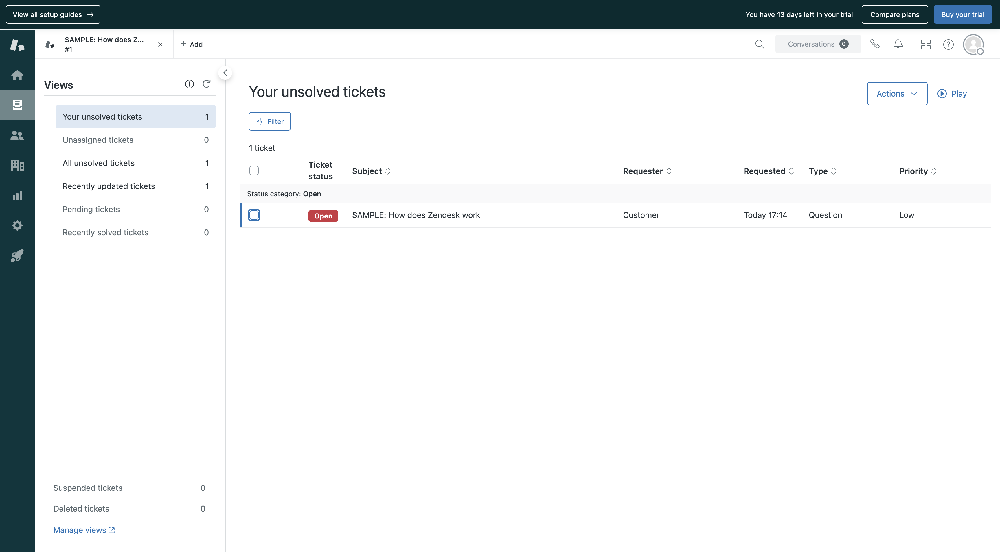

**What I did:**  
Reviewed default Zendesk views used to organize tickets by status, assignment, and priority.

**Why it matters:**  
Views allow teams to triage and manage ticket volume efficiently.

**Skills demonstrated:**  
- Queue management  
- Ticket triage  

---

### 7. New and Unassigned Tickets View
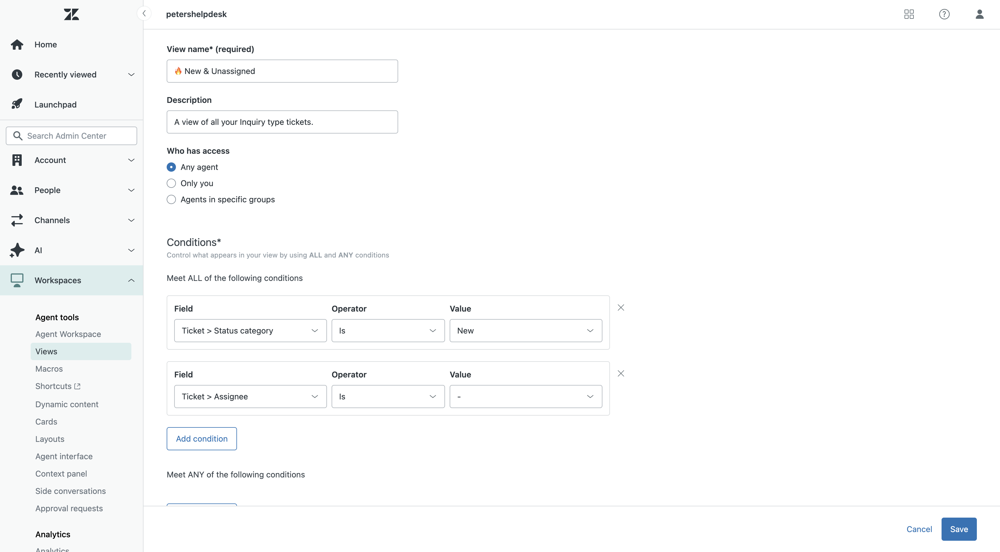

**What I did:**  
Worked with the **New & Unassigned** view to identify tickets that require agent action.

**Why it matters:**  
Prevents tickets from sitting unattended and improves response times.

**Skills demonstrated:**  
- Proactive ticket monitoring  
- Support queue prioritization  

---

### 8. Macros Page
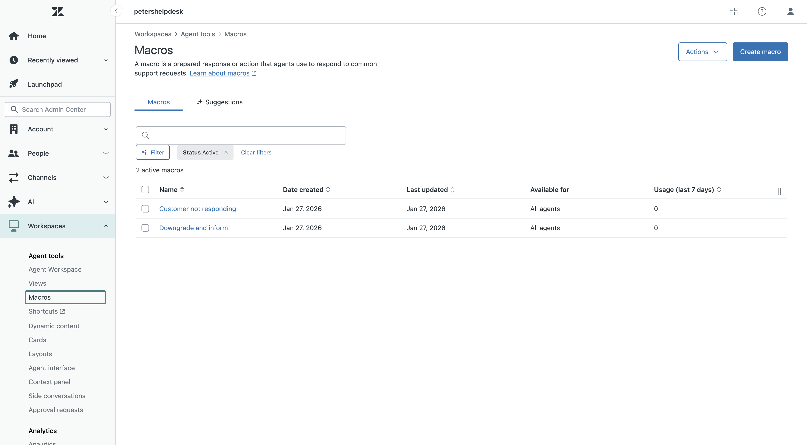

**What I did:**  
Accessed Zendesk macros used to standardize and speed up common responses.

**Why it matters:**  
Macros reduce response time and ensure consistent communication.

**Skills demonstrated:**  
- Zendesk macros  
- Workflow efficiency  

---

### 9. Macro Used: Request More Information

**What I did:**  
Applied a macro to request additional information from the customer.

**Why it matters:**  
Ensures agents gather required details quickly without manual typing.

**Skills demonstrated:**  
- Macro execution  
- Customer follow-up workflows  

---

### 10. New Ticket Submitted
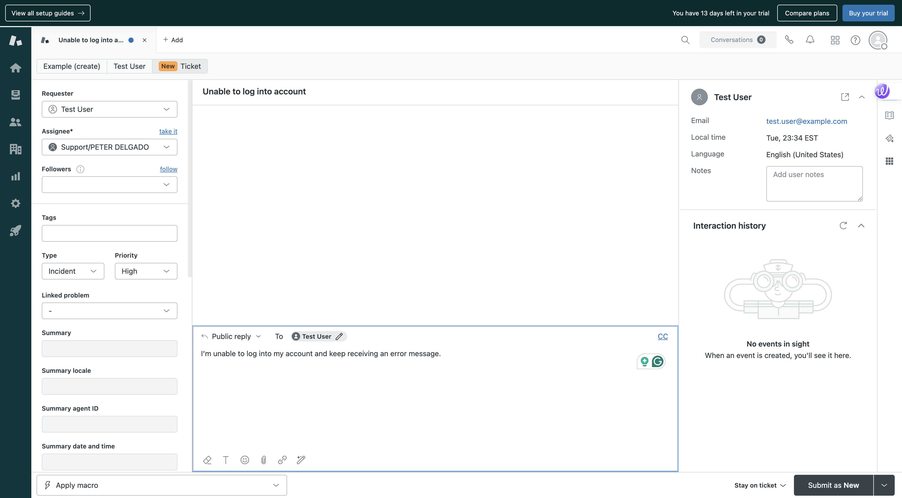

**What I did:**  
Created and submitted a new ticket to validate form behavior and field visibility.

**Why it matters:**  
Confirms that ticket forms and required fields work as expected.

**Skills demonstrated:**  
- Ticket creation  
- Form validation  

---

### 11. Ticket Form Editable Enabled
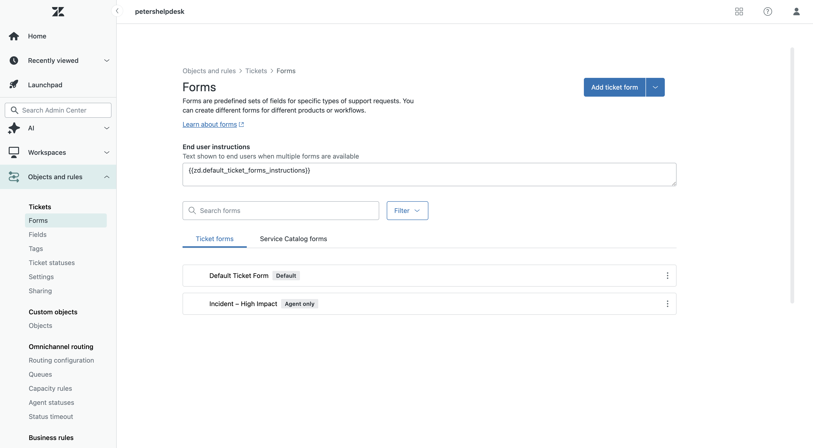

**What I did:**  
Configured ticket form permissions to control which fields are editable.

**Why it matters:**  
Prevents incorrect data entry and enforces process consistency.

**Skills demonstrated:**  
- Ticket form configuration  
- Field permissions  

---

### 12. SLA Policy Setup
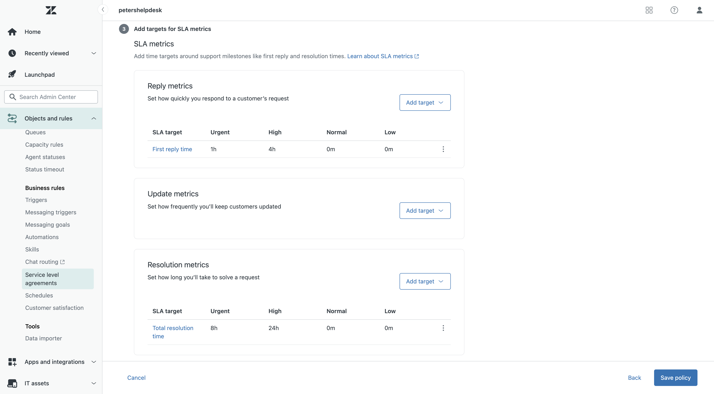

**What I did:**  
Created an SLA policy with priority-based response and resolution targets.

**Why it matters:**  
SLAs ensure timely support and provide measurable performance standards.

**Skills demonstrated:**  
- SLA configuration  
- Priority-based service levels  

---

### 13. High Priority Ticket Created
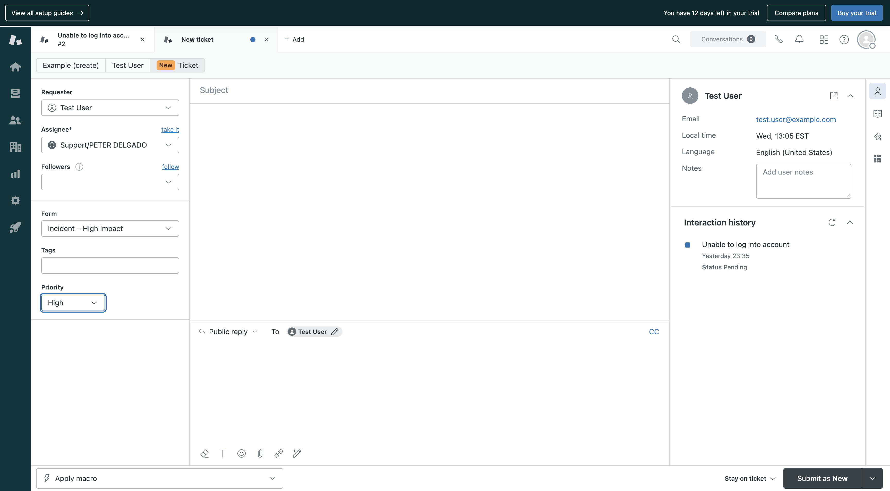

**What I did:**  
Created a high-impact incident ticket to test priority and SLA behavior.

**Why it matters:**  
Validates that urgent issues trigger appropriate response expectations.

**Skills demonstrated:**  
- Incident handling  
- SLA validation  

---

### 14. Ticket Response and Ongoing Communication
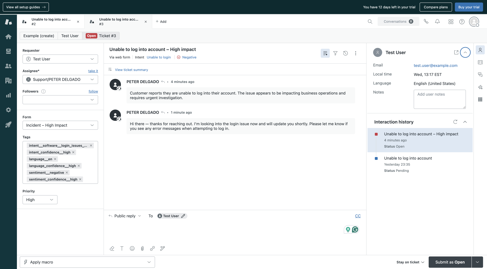

**What I did:**  
Responded to the ticket and continued customer communication while the ticket remained open.

**Why it matters:**  
Ongoing updates help maintain customer trust and meet SLA update requirements.

**Skills demonstrated:**  
- Customer follow-up  
- Ticket communication management  
